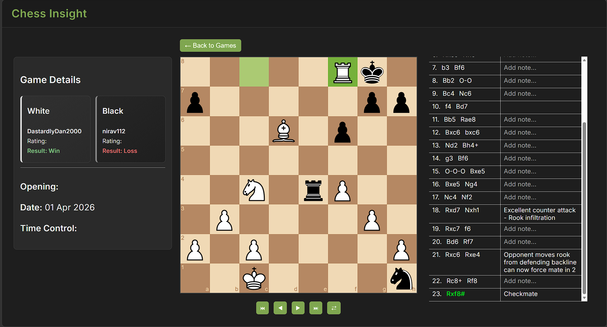
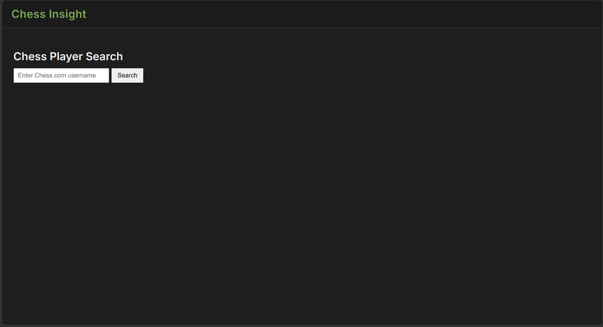
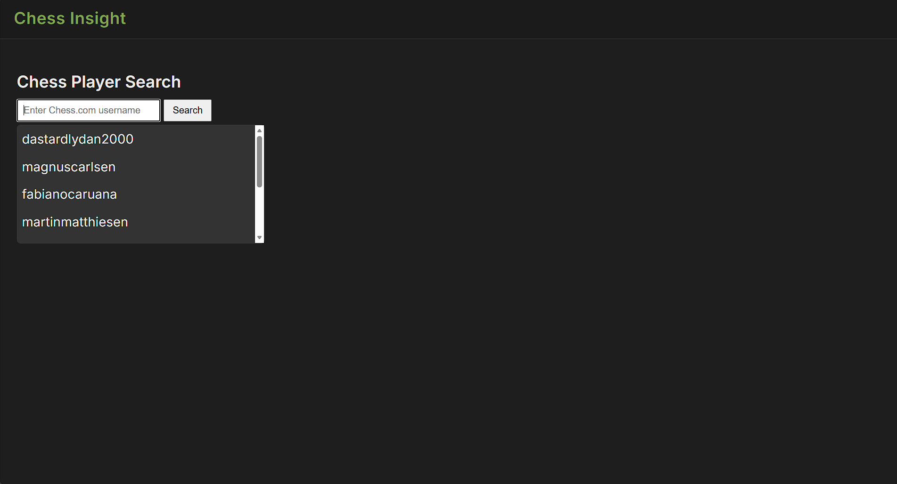
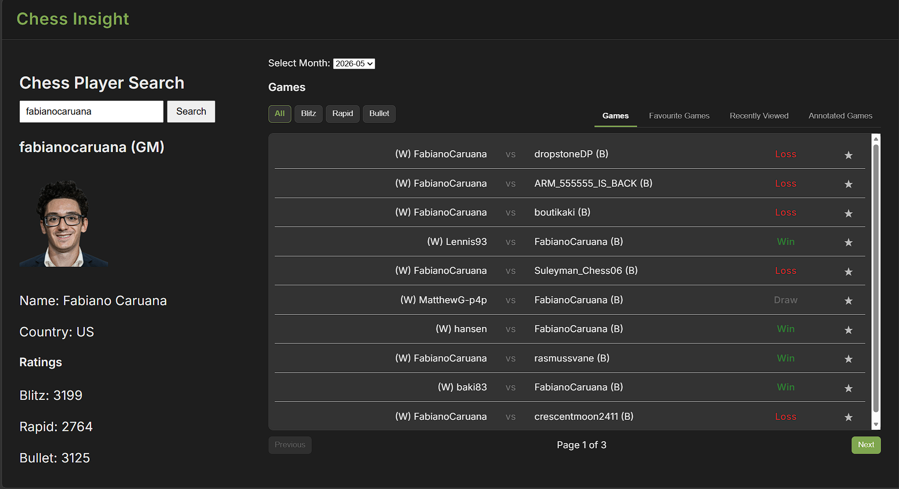
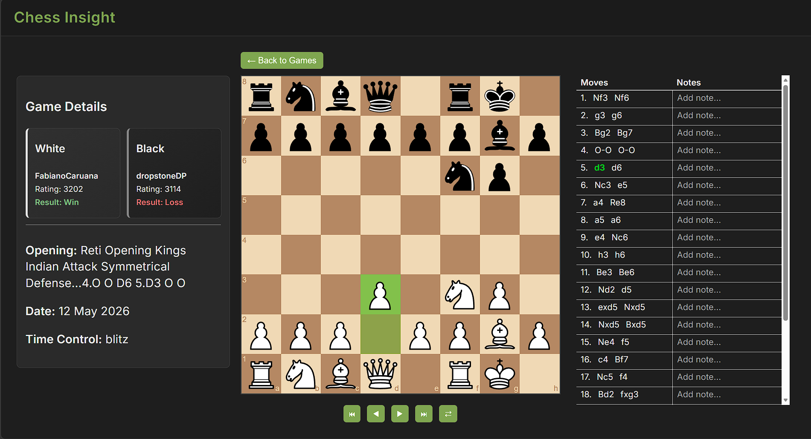
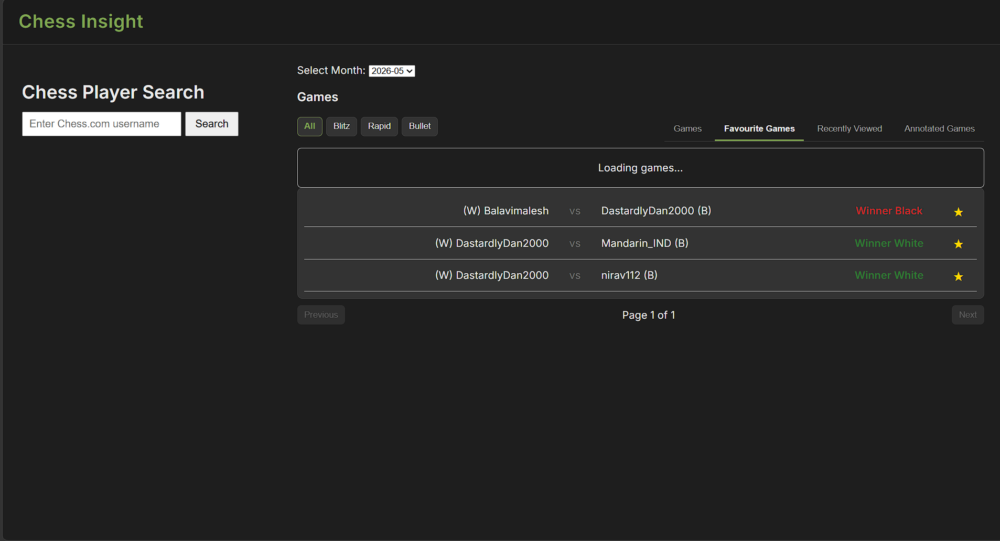
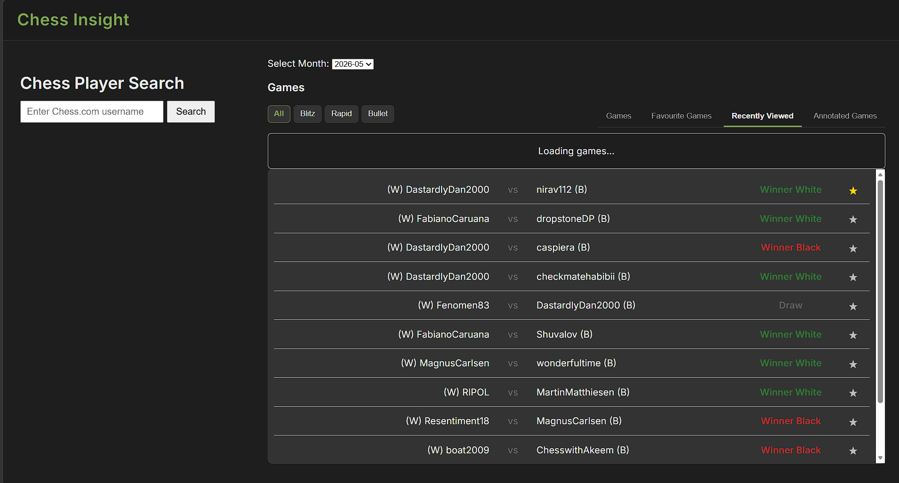

# ChessInsight


[](https://chess-insight-lbehyx2ip-daniel-mc-namee-s-projects.vercel.app/)

ChessInsight is a full-stack chess analysis and replay platform built using Angular, Node.js, Express, and MongoDB.

The application integrates with the Chess.com public API to allow users to search for players, browse archived games, replay matches move-by-move, and create persistent move annotations stored in MongoDB.

The project was designed to demonstrate full-stack web development, REST API integration, state management, third-party library integration, and cloud deployment using modern technologies (Originally AWS).



---

# Live Demo

[https://chess-insight-lbehyx2ip-daniel-mc-namee-s-projects.vercel.app/](https://chess-insight-lbehyx2ip-daniel-mc-namee-s-projects.vercel.app/)

Note: The backend is hosted on Render's free tier and may take around 30-60 seconds to wake up on the first request after inactivity.

---

# Features

* Chess player search using Chess.com API
* Player profile and rating display
* Archive browsing for historical games
* Interactive chess replay system
* Move-by-move navigation controls
* Board orientation toggle
* Move highlighting
* Move annotation system
* Favourite games system
* Recent games tracking
* Search history persistence
* MongoDB data persistence
* Full-stack cloud deployment

---

# Tech Stack

### Frontend

* Angular
* TypeScript
* HTML
* CSS

### Backend

* Node.js
* Express.js

### Database

* MongoDB Atlas

### APIs & Libraries

* Chess.com Public API
* chess.js
* chessboard-element

### Deployment

* AWS (Orignally)
* Vercel (Frontend)
* Render (Backend)

---

# Architecture Overview

The application uses a full-stack architecture consisting of:

### Frontend

Angular handles the user interface, state management, routing, replay controls, filtering, pagination, and interaction logic.

### Backend

Express provides REST API endpoints which manage:

* Search history
* Favourite games
* Recent games
* Move annotations
* Chess.com API requests

### Database

MongoDB Atlas stores:

* Favourite games
* Recent games
* Search history
* Move annotations linked to specific games and move numbers

---

# Installation

Clone the repository

```bash
git clone https://github.com/daniel-mcnamee-dev/ChessInsight.git
```

Navigate into the frontend project

```bash
cd ChessInsight/chess-insight
```

Install frontend dependencies

```bash
npm install
```

Navigate into backend project

```bash
cd ../chess-insight-api
```

Install backend dependencies

```bash
npm install
```

---

# Environment Variables

Create a `.env` file inside the `chess-insight-api` directory:

```env
ATLAS_URI=your_mongodb_connection_string
PORT=3000
```

---

# Running the Application

## Start Backend

Inside `chess-insight-api`

```bash
node server.js
```

Backend runs on:

```text
http://localhost:3000
```

---

## Start Frontend

Inside `chess-insight`

```bash
ng serve
```

Frontend runs on:

```text
http://localhost:4200
```

---

# Application Walkthrough

## Homepage



---

## Player Search

Search suggestions and player lookup functionality.



---

## Player Profile & Game Archives

Player profile information and rating statistics.
Browse historical archives and filter games by time control.



---

## Game Replay System

Interactive replay interface powered by chess.js and chessboard-element.



---

## Move Annotations

Users can create and save move notes linked to specific moves and games.


---

## Favourite Games

Persistent favourite games system stored in MongoDB.



---

## Recent Games

Recently viewed games are automatically tracked and stored.



---

# Key Technical Features

## Angular Signals

The frontend uses Angular Signals for reactive state management across:

* Player data
* Archives
* Games
* Replay state
* Pagination
* Filtering
* UI interaction

---

## Replay Engine

The replay system uses:

* chess.js for chess logic and move validation
* FEN notation for board synchronisation
* Dynamic move highlighting
* Interactive navigation controls

---

## Annotation System

One of the more technically challenging aspects of the project was the move annotation system.

Annotations are:

* Linked to specific PGN game records
* Linked to exact move numbers
* Persisted in MongoDB
* Dynamically loaded into the replay interface

---

## REST API Design

The Express backend exposes REST endpoints for:

* Player search history
* Favourite games
* Recent games
* Move annotations
* Archive retrieval

The backend also acts as an intermediary layer between the frontend and the Chess.com API.

---

# Deployment

## Frontend

Hosted on Vercel:

* Automatic deployments from GitHub
* Angular production build hosting
* HTTPS enabled

## Backend

Hosted on Render:

* Express API hosting
* MongoDB Atlas integration
* Environment variable configuration

## Database

Hosted on MongoDB Atlas:

* Cloud-hosted NoSQL database
* Persistent game annotation and user data storage

---

# Purpose

This project was developed to demonstrate:

* Full-stack web development
* Angular application architecture
* REST API development
* MongoDB integration
* Third-party API integration
* Cloud deployment workflows
* Interactive frontend development
* State management
* Full-stack debugging and deployment

---

# Author

Daniel McNamee
Software Development Student
Atlantic Technological University (ATU) Sligo

GitHub
[https://github.com/daniel-mcnamee-dev](https://github.com/daniel-mcnamee-dev)
